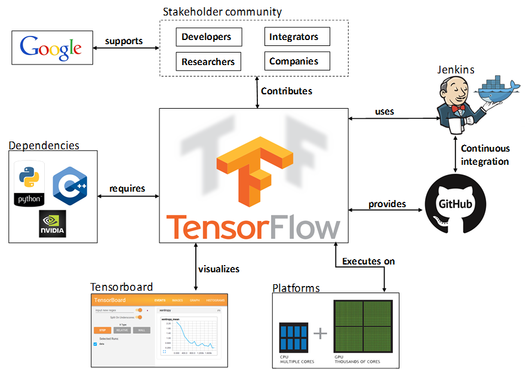
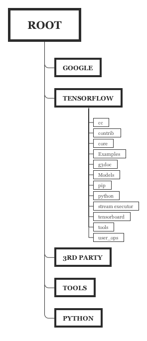
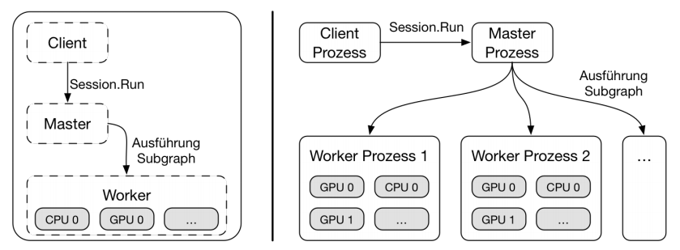

# TensorFlow-Architektur

## Was ist TensorFlow
TensorFlow ist eine Machine Learning Bibliothek, welche 2015 von Google als  Open-Source veröffentlicht wurde. Der Schwerpunkt der Bibliothek liegt auf neuronalen Netzen und tiefen neuronalen Netzen, die in der letzen Zeit eine umfangreiche Anwendung in vielen Bereichen der künstlichen Intelligenz wie Bilderkennung und Spracheanalyse gefunden haben. 

TensorFlow wurde als Nachfolger einer anderen Bibliothek für Machine Learning, **DistBelief**, entwickelt. DistBelief wurde im Rahmen des Google Brain Projekts im Jahr 2011 entwickelt, um die Nutzung von hochskalierbaren tiefen neuronalen Netzen (DNN) zu erforschen. Die Bibliothek wurde unter anderem für unsupervised Lernen, Bild- und Spracherkennung und auch bei der Evaluation von Spielzügen im Brettspiel Go eingesetzt.[@TensorFlow2018]

Trotz des erfolgreichen Einsatzes hatte DistBelief einige Einschränkungen:

- die NN-Schichten mussten (im Gegensatz zum genutzten Python-Interface) aus Effizienz-Gründen mit C++ definiert werden. <!-- Nur die NN Schichten oder die Modelle allgemein? -->
- die Gradientenfunktion zur Minimierung des Fehlers erforderte eine Anpassung der Implementierung des integrierten Parameter-Servers. 
- nur vorwärtsgerichtete Algorithmen möglich rekurrente KNN oder Reinforcement Learning möglich.
- wurde nurfür die Anwendung auf großen Clustern von Multi-Core-CPU-Servern entwickelt, keine Unterstützung von GPUs oder anderen Prozessoren.

Aus den Erfahrungen mit DistBelief wurde gelernt und diese Erfahrungen wurden bei der Entwicklung von TensorFlow berücksichtigt. Interessant ist, dass DistBelief zwar als Prototyp für TensorFlow genommen wurde, an dem verschiedene Funktionalitäten ausprobiert und getestet wurden, allerdings wurde TensorFlow komplett neu entwicklelt. Das ist ein Beispiel dafür, dass Prototype sehr praktisch sind, dass es jedoch auch wichtig ist, deren Vor- und Nachteile zu bewerten und im Laufe der Entwicklung Prototype auch zu verwerfen.

Im Weiteren werden die Anforderungen verschiedener Benutzergruppen beschrieben und die Architektur der Bibliothek ausführlich erläutert.

## Anforderungsanalyse

TensorFlow wird von verschiedenen **Benutzergruppen** verwendet:

- Forscher, Studenten, Wissenschaftler
- Architekten und Software Engineure
- Software Entwickler
- Hardware Hersteller. <!-- Stakeholder -->

Die Bibliothek wird vor allem zur Entwicklung der Anwendungen mit AI-Funktionalitäten eingesetzt. Zusätzlich wir sie zur Forschungszwecken im Bereich Machine Learning zur Entwicklung der neuen Algorithmen und Modelle verwendet. Außerdem gehören auch Hardware-Hersteller zu einer der Benutzergruppen von TensorFlow, die ihre Produkte (zB. CPUs, GPUs etc.) für Machine Learning-Zwecke optimieren wollen. 

Aus diesen Anwendungsfällen lassen sich die **Anforderungen** an die Bibliothek ableiten:

| ID            | Kurzbeschreibung           | Anforderung                                                  |
| ------------- | -------------------------- | ------------------------------------------------------------ |
| AF1{#af1}     | ML und DL Funktionalitäten | Da Machine Learning auf mathematischen Berechnungen beruht, muss TensorFlow Vektor- bzw Matrizen-Operationen und andere Rechenoperationen aus Linearen Algebra und Statistik bereitstellen. |
| AF1.1{#af1.1} | Gradients                  | Viele Trainingsalgorithmen benötigen Gradienten, deshalb muss TensorFlow diese selbst bestimmen können. |
| AU1{#au1}     | Protoyping                 | TensorFlow muss eine Möglichkeit zum schnellen Definieren und Testen von Modellen bereitstellen. |
| AU2{#au2}     | Produktiver Einsatz        | TensorFlow muss für den produktiven Einsatz (vor allem Inference) geeignet sein. |
| AP1{#ap1}     | Performance                | Da Maschine Learning durch Rechenleistung limitiert ist, muss TensorFlow die verfügbaren Ressourcen effizent nutzen. |
| AP2{#ap}      | Skalierbarkeit             | TensroFlow muss mit sehr großen Datenmengen umgehen können.  |
| AS1{#as1}     | Portabilität               | Die Bibliothek muss auf verschiedene Systeme portierbar sein und unterschiedliche Acceleratoren (GPU, TPU) untersützten. |
| AR1{#ar}      | Recovery                   | Der Trainingsfortschritt soll nach einem Absturtz wiederherstellbar sein |

Portabilität => Device Layer, Kernel implementations

Skalierbarkeit => verteilt, mehrere Worker (Distributed Master, Dataflow Executor, Worker Services)

Perfomence => C++ Client, Kernel implementations

--Runs on CPUs, GPUs, desktop, server,	or mobile computing	platforms. That	make it	very suitable in several fields	of application, for	instance medical, finance, consumer	electronic,	etc.

Flexibilität:	 => High & Low Level APIs

Vielfältige Einsatzmöglichkeit: Forschung, Prototypen und Produktion  => Python Client, High Level Libraries
--TensorFlow™ allows industrial researchers a faster product prototyping. It also provides	academic researchers with a	development	framework and a	community to discuss and support novel applications.

--Provides tools to assemble graphs for expressing	diverse	machine	learning models. New perations	can	be written in Python and low-level data	operators are implemented using	in C++.
Portabilität

​

### Einflussfaktoren

| Faktor-Index | Beschreibung                                                 | Flexibilität | Einfluss |
| ------------ | ------------------------------------------------------------ | ------------ | -------- |
| O1           | Interessen der Benutzergruppen müssen berücksichtigt werden  | Fest         | mittel   |
| O2           | Schnelle Auslieferungen von neuen Features (u.U. eingeschränkte Kapazitäten) | Flexibel     | mittel   |
| P1           | ML und DL Funktionalitäten                                   | Fest         | stark    |
| P2           | Schnelle Erstellung von Prototypen                           | Fest         | stark    |
| P3           | Erstellung produktiv einsetzbarer Modelle                    | Fest         | stark    |
| P4           | Anpassungen und Entwicklung neuer Modelle                    | Fest         | stark    |
| T1           | Schnelle Performance                                         | Fest         | stark    |
| T2           | Große Datenvolumen und rechenintensive Operationen           | Fest         | stark    |
| T3           | Portabilität ( soll auf verschiedenen Systemen  wie Desktop, Server, Mobile Geräte etc. ausführbar sein) | Fest         | stark    |
| T4           | Stabilität und Fehlertoleranz                                | Fest         | stark    |
| T5           | Erweiterbarkeit                                              | Fest         | stark    |

## Architekturentwurf

Im Weiteren werden 4 Sichten der TensorFlow-Architektur dargestellt: Kontext-Sicht, Entwurfssicht (Development View), Ablaufssicht (Process View) und Physikalische Sicht (Deployment View).

### Kontext-Sicht

{height=400px}

###Verhaltenssicht (Architekturbausteine)

### 

### 

###Struktursicht

Tensorflow ist in mehren Schichten Organisiert. Diese reichen von einer Gerätespezifischen Schicht (unten) bis zu High Level Training und Inference Bibliotheken (oben). Diese Schichtenarchitektur erlaubt ein hohes Maß and Flexibilität und Portabilität.

Der Tensorflow Core stellt seine Funktionalität über eine Low-Level C API bereit. Diese Low-Level API wird durch High-Level APIs für verschiedene Client Sprachen, wie Python, C++, Java und Go gekpaselt. Unter Verwendung der Sprachspezifischen APIs gibt es High-Level Bibliotheken für Training und Inference. 

#### Kernels

- Kernels sind Implementierungen von Operationen, die speziell für die Ausführung auf einer bestimmten Recheneinheit wie CPU oder GPU entwickelt wurden.
- Die TensorFlow-Bibliothek enthält mehrere solche eingebaute Operationen/Kernels. Beispiele dafür sind:

| Kategorie                               | Beispiele                                            |
| --------------------------------------- | ---------------------------------------------------- |
| Elementweise mathematische Operationen  | Add, Sub, Mul, Div, Exp, Log, Greater, Less, Equal   |
| Array-Operationen                       | Concat, Slice, Split, Constant, Rank, Shape, Shuffle |
| Matrix-Operationen                      | MatMul, MatrixInverse, MatrixDeterminant             |
| Variablen und Zuweisungsoperationen     | Variable, Assign, AssignAdd                          |
| Elemente von Neuronalen Netzen          | SoftMax, Sigmoid, ReLU, Convolution2D, MaxPool       |
| Checkpoint-Operations                   | Save, Restore                                        |
| Queue und Synchronisations- operationen | Enqueue, Dequeue, MutexAcquire, MutexRelease         |
| Flusskontroll-Operationen               | Merge, Switch, Enter, Leave, NextIteration           |

###  Source-Code-Hierarchie

--TensorFlow™ 's root directory	at GitHub is organized in five main	subdirectories: google, tensorflow, third-party, tools and util/python. Additionally, the root directory provides information on how to contribute to the project, and other relevant documents. In figure 3, the source code hierarchy is illustrated.

{height=400px}

###	Abblidungssicht (Ausführungseinheiten)

