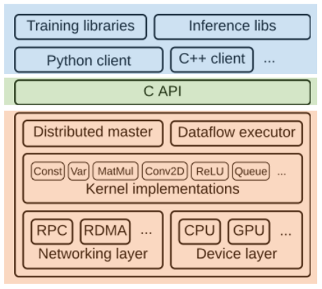
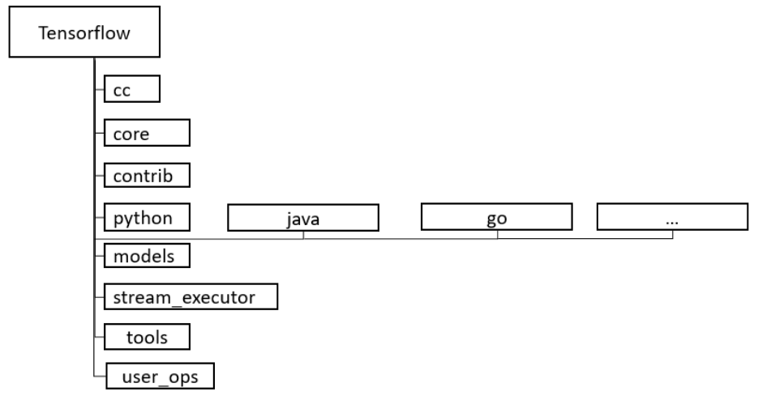

# TensorFlow

TensorFlow ist eine Machine Learning Bibliothek, welche 2015 von Google als  Open-Source veröffentlicht wurde. Der Schwerpunkt der Bibliothek liegt auf neuronalen Netzen und tiefen neuronalen Netzen, die in der letzen Zeit eine umfangreiche Anwendung in vielen Bereichen der künstlichen Intelligenz wie Bilderkennung und Spracheanalyse gefunden haben. 

TensorFlow wurde als Nachfolger einer anderen Bibliothek für Machine Learning, **DistBelief**, entwickelt. DistBelief wurde im Rahmen des Google Brain Projekts im Jahr 2011 entwickelt, um die Nutzung von hochskalierbaren tiefen neuronalen Netzen (DNN) zu erforschen. Die Bibliothek wurde unter anderem für unsupervised Lernen, Bild- und Spracherkennung und auch bei der Evaluation von Spielzügen im Brettspiel Go eingesetzt. [@LargeScale2012, S.1]

Trotz des erfolgreichen Einsatzes hatte DistBelief einige Einschränkungen:

- die NN-Schichten mussten (im Gegensatz zum genutzten Python-Interface) aus Effizienz-Gründen mit C++ definiert werden. <!-- Nur die NN Schichten oder die Modelle allgemein? -->
- die Gradientenfunktion zur Minimierung des Fehlers erforderte eine Anpassung der Implementierung des integrierten Parameter-Servers. 
- nur vorwärtsgerichtete Algorithmen möglich rekurrente KNN oder Reinforcement Learning möglich.
- wurde nurfür die Anwendung auf großen Clustern von Multi-Core-CPU-Servern entwickelt, keine Unterstützung von GPUs oder anderen Prozessoren. [@DelftUniversity2017]

Aus den Erfahrungen mit DistBelief wurde gelernt und diese Erfahrungen wurden bei der Entwicklung von TensorFlow berücksichtigt. Interessant ist, dass DistBelief zwar als Prototyp für TensorFlow genommen wurde, an dem verschiedene Funktionalitäten ausprobiert und getestet wurden, allerdings wurde TensorFlow komplett neu entwicklelt. Das ist ein Beispiel dafür, dass Prototype sehr praktisch sind, dass es jedoch auch wichtig ist, deren Vor- und Nachteile zu bewerten und im Laufe der Entwicklung Prototype auch zu verwerfen. [@LargeScale2012, S.2]

Im Weiteren werden die Anforderungen verschiedener Benutzergruppen beschrieben und die Architektur der Bibliothek ausführlich erläutert.

# Anforderungsanalyse

TensorFlow wird von verschiedenen **Benutzergruppen** verwendet:

- Forscher, Studenten, Wissenschaftler
- Architekten und Software Engineure
- Software Entwickler
- Hardware Hersteller. <!-- Stakeholder -->

Die Bibliothek wird vor allem zur Entwicklung der Anwendungen mit AI-Funktionalitäten eingesetzt. Zusätzlich wir sie zur Forschungszwecken im Bereich Machine Learning zur Entwicklung der neuen Algorithmen und Modelle verwendet. Außerdem gehören auch Hardware-Hersteller zu einer der Benutzergruppen von TensorFlow, die ihre Produkte (zB. CPUs, GPUs etc.) für Machine Learning-Zwecke optimieren wollen. 

## Anforderungen

Aus diesen Anwendungsfällen lassen sich die **Anforderungen** an die Bibliothek ableiten, die nach FURPS-Merkmalen aufgeteilt werden können. FURPS steht für:

- Functionality (Funktionalität)
- Usability (Benutzbarkeit)
- Reliability (Zuverlässigkeit)
- Performance (Effizienz)
- Supportability (Änderbarkeit, Wartbarkeit) 

| ID   | Kurzbeschreibung           | Anforderung                                                  |
| ---- | -------------------------- | ------------------------------------------------------------ |
| F1   | ML und DL Funktionalitäten | Da Machine Learning auf mathematischen Berechnungen beruht, muss TensorFlow Vektor- bzw Matrizen-Operationen und andere Rechenoperationen aus Linearen Algebra und Statistik bereitstellen. Viele Trainingsalgorithmen benötigen Gradienten, deshalb muss TensorFlow diese selbst bestimmen können. |
| U1   | Protoyping                 | TensorFlow muss eine Möglichkeit zum schnellen Definieren und Testen von Modellen bereitstellen. |
| U2   | Produktiver Einsatz        | TensorFlow muss für den produktiven Einsatz (vor allem Inference) geeignet sein. |
| P1   | Performance                | Da Maschine Learning durch Rechenleistung limitiert ist, muss TensorFlow die verfügbaren Ressourcen effizent nutzen. |
| P2   | Skalierbarkeit             | TensroFlow muss mit sehr großen Datenmengen umgehen können.  |
| S1   | Portabilität               | Die Bibliothek muss auf verschiedene Systeme portierbar sein und unterschiedliche Acceleratoren (GPU, TPU) untersützten. |
| R1   | Recovery                   | Der Trainingsfortschritt soll nach einem Absturtz wiederherstellbar sein |

: Anforderungen an TensorFlow

## Einflussfaktoren

Folgende organisatorische, technische und Produkt-bezogene Faktoren können einen Einfluss auf die Architektur-Entscheidung beeinflusst haben.

| Faktor-Index | Beschreibung                                                 |
| ------------ | ------------------------------------------------------------ |
| O1           | Community, welche verwendet und Contributions macht          |
| O2           | Entwickler und interne Nutzer haben Kenntnisse in C++und Python |
| T1           | Es werden neue Acceleratoren entwickelt                      |
| T2           | Die Rechenleistung einer Maschine ist begrenzt, weshalb horizontal skaliert werden muss |
| T3           | Auf Clustern und im Produktiven Einsatz kommt vor allem Linux zum Einsatz, die User verwenden oft OS  X oder Windows. Es muss aber auch auf noch unbekannten Betriebsystem einsetzbar sein. |
| P1           | Neue Bibliotheken können integriert werden                   |
| P2           | Modell kann sehr komplex werden und viele Daten involvieren  |

: Einflussfaktoren

# Architekturentwurf

Im Weiteren werden 4+1 Sichten der TensorFlow-Architektur dargestellt: Szenarien, Kontext-Sicht, Verhaltenssicht, Struktursicht, Abbildungssicht.

## Szenarien

Die Hauptbenutzer von TensorFlow sind 1) Software-Architekten und Engineure, die ML-Anwendungen entwerfen und schnelle Prototypen benötigen 2) Entwickler, die ML-Anwendungen für den produktiven Einsatz entwickeln 3) Studierenden und Wissenschaftler, die das Framework für das Experimentieren und die Entwicklung neuer ML-Algorithmen verwenden.

## Kontext-Sicht

TensorFlow wurde uersprünglich von Google entwickelt und ist auch immer noch unter der Kontrolle von Google. Auch wenn das Projekt Open Source ist, trägt Google im Wesentlichen der Weiterentwicklung von TensorFlow bei, managt den Prozess und unterstützt die Contributors und die Community. Zudem sind Firmen, die das Framework einsetzen ebenfalls an der Weiterentwicklung des Projekts interessiert, ebenso wie die Integrators, die vor allem an der schnellen Performance und Unterstützung für ihre Plattformen interessiert sind. Die Wissenschaftler legen einen großen Wert auf die Einfachheit der Verwendung, die Möglichkeit der schnellen Entwicklung der Prototypen, sowie Hilfstools (Visualisierungen wie Tensorboard, Debugging etc.)

Zur Versionsverwaltung und Collaberation kommt ein öffentliches GitHub Repository zum Einsatz. Neue Versionen werden automatisch von einer Jenkins CI für verschiedene Plattformen gebaut und getestet. 

TensorFlow verwendet externe Bibliotheken, beispielsweise für Lineare Algebra oder die CUDA Schnittstelle für Nvidia GPUs. Viele der High Level Bibliotheken sind in Python und das Backend in C++ geschrieben, weshalb es einen Python Interpreter und eine C++ Laufzeit zum ausführen benötigt und einen C++ Compiler zum bauen. [@DelftUniversity2017]

{height=400px}

## Verhaltenssicht (Architekturbausteine)

[@Graph2018]

In TensorFlow werden Berechnungen als Graphen dargestellt. Diese Graphen lassen sich innerhalb einer Session ausführen. In den Graphen gibt es drei Grundarten von Knoten: Operationen, Placeholder und Variablen. Placeholder werden beim ausführen durch einen konkreten Wert ersetzt. Sie stellen Eingabewerte (hier der Input Node) dar. Variablen halten Werte, die in der Session gespeichtert und verändert werden können. Hier sind das beispielsweise die Weights $W$ und Biaseses $b$. Operationen sind hier Beispielsweise Matrix Multiplikation $MatMul$ oder $BiasAdd$. Die Ein- und Ausgabewerte der Knoten sind jeweils Tensoren, welche entlang der Kanten "fließen". Ein Subgraph lässt sich zu einer Komponente zusammenfassen, hier sind das $ReLu\space Layer$, $Logit\space Layer$ und $SDG\space Trainer$.

Der Graph stellt ein Neuronales Netzwerk mit zwei Layern dar, welches Classification macht und über Statistic Gradient Descent trainiert wird. Die Trainingsdaten werden im $Input$ Placeholder eingegeben und in Labels und die Feature Matrix aufgeteilt. Die Feature Matrix f[r] die Eingabedaten für den Forwardpass durch das Neuronale Netz genutzt. In vektorisierter Form lässt sich die Multiplikation jedes Features mit dem entsprechenden Gewicht für alle Samples als Matrixmultiplikation ausdrücken. Der erste Layer nutzt ReLu als *activation function*, deren Ausgabe Matrix die Eingabe für den zweiten Layer ist.
Für das Training werden die Labels als One-Hot-Vektor kodiert ($Class\space Labels$) und über die $Cross\space Entropie$ Cost-Function mit der Ausgabe des letzten Layers Netzes verglichen. Der Trainingsprozess besteht darin, dass mit Hilfe von Gradient Descent die Variablen die Cost-Function für die Trainingsdaten minimiert wird, indem die $W$ und $b$ in kleinen Schritten angepasst werden. Da ein Minimum der Cost-Function gesucht wird. Anhand der partiellen Ableitungen (Gradients) nach den Variablen ergibt sich die Richtung in der Sich das Minimum befindet und entsprechend werden die Variablen geupdated in den $Update$ angepasst. Das geschieht in mehren Iterationen, sodass man entsprechend Gradients sich einem (lokalen) Minimum annähert.
Bei Inference wird die Ausgabe des letzten Layers durch die Softmax-Funktion in den Interval [0,1] gebracht, was der Wahrscheinlichkeit entspricht, mit der das Netz ein Sample einer Klasse zuordnet. Das Netz nutzt dazu die in der Session gespeicherten trainierten *Weights* und *Biases*. Der Gleiche Graph kann auch in unterschiedlichen Session für unterschiedliche Daten trainiert werden.

 

## Struktursicht

Tensorflow ist in mehren Schichten organisiert. Diese reichen von einer Geräte-spezifischen Schicht (unten) bis zu High Level Training und Inference Bibliotheken (oben). Der Tensorflow Core stellt seine Funktionalität über eine Low-Level C API bereit. Diese Low-Level API wird durch High-Level APIs für verschiedene Client-Sprachen, wie Python, C++, Java und Go gekpaselt. Unter Verwendung der Sprachspezifischen APIs gibt es High-Level Bibliotheken für Training und Inference. 

Diese Schichtenarchitektur erlaubt ein hohes Maß and Flexibilität und Portabilität. So kann auf dem Device Layer beispielsweise Unterstützung für Acceleratoren wie GPUs und TPUs hinzugefügt werden, Kernelimplementationen hinzugefügt oder ersetzt werden und eine zusätztliche Schnittstelle für eine andere Sprache hinzugefügt werden.

High-Level Python Bibliotheken erlauben das schnelle prototyping und Training von Modellen und Algorithmen. Die C++ und Java Clients dagegen untersützt das einbinden trainierter Modelle in Produktivsysteme, auf welchen hohe Inference Performance gefordert ist.

Der Distribution master ist dafür verantwortlich die Berechnungen auf mehre Dataflow Executer aufzuteilen. Dabei werden transparent *Send* und *Recive* Nodes an den Kanten eingefügt, an denen der Graph partitioniert wird. Die Dataflow Executer können dabei auf mehre Maschienen verteilt werden, die passende Kommunikation wird vom Network Layer abstrahiert.

[@TensorFlowArchitecture2018]

#### Kernels

- Kernels sind C++ Implementierungen von Operationen, die speziell für die Ausführung auf einer bestimmten Recheneinheit wie CPU oder GPU entwickelt wurden. Da sie zu nativiem Maschinencode kompiliert werden und sehr Hardware nah geschrieben sind, können sie diese optimal ausnutzten und sehr hohe Performance erzielen.  
- Die TensorFlow enthält mehrere solche eingebaute Operationen/Kernels. Beispiele dafür sind: 

| Kategorie                               | Beispiele                                            |
| --------------------------------------- | ---------------------------------------------------- |
| Elementweise mathematische Operationen  | Add, Sub, Mul, Div, Exp, Log, Greater, Less, Equal   |
| Array-Operationen                       | Concat, Slice, Split, Constant, Rank, Shape, Shuffle |
| Matrix-Operationen                      | MatMul, MatrixInverse, MatrixDeterminant             |
| Variablen und Zuweisungsoperationen     | Variable, Assign, AssignAdd                          |
| Elemente von Neuronalen Netzen          | SoftMax, Sigmoid, ReLU, Convolution2D, MaxPool       |
| Checkpoint-Operations                   | Save, Restore                                        |
| Queue und Synchronisations- operationen | Enqueue, Dequeue, MutexAcquire, MutexRelease         |
| Flusskontroll-Operationen               | Merge, Switch, Enter, Leave, NextIteration           |

: Kernel Implementierungen

Außerdem untersützt TensorFlow das einbinden eigener Kernel.

## Source-Code-Hierarchie

Die Architektur lässt sich in den Verzeichnissen auf TensorFlow-GitHub wiedererkennen. Die Code-Hierarchie enthält folgende Verzeichnisse: 

{height=400px}

[@GitHub2018]

- cc: Funktions-Wrapper für den C++ Code.
- core: Implementierung der Hauptfunktionalitäten von TensorFlow.
- contrib: Neue Features, die von den Contributors zum Open Source Projekt beigetragen werden und später unter Umständen in den Core übertragen werden können.
- models: Modelle für spezielle ML Anwendungsfälle.
- python: Python API.
- java: Java API.
- go: Go API.
- stream-executor: Interface für Hardware-Acceleratoren (z.B. GPUs).
- tools: Entwicklungsumgebung für das Framework.
- user_ops: Wrapper für die Benutzer-spezifischen (angepassten) Funktionen.

## Abblidungssicht (Ausführungseinheiten)

Die in TensorFlow erstellten Programme (Modelle) können sowohl lokal auf einem System, als auch verteilt auf mehreren Systemen ausgeführt werden. Der Master-Prozess kümmert sich um die Verteilung der Operationen zwischen den verfügbaren Ressourcen. 

[@LargeScale2012, S. 5]

# Fazit

Zusammenfassend lässt sich festhalten, dass sich die Anforderungen an das ML-Framework in der Architektur von TensorFlow wieder finden. Das Framework beitet die wesentlichen **Machine Learning Funktionalitäten** mit einer Spezialisierung für Deeplearning (breite Gradient Descent Unterstütztung). Die High-Level API erleichtert die Erstellung von Prototypen, während die Low-Level API die Möglichkeit bietet, flexibel zu bleiben und die Modelle anzupassen, um allen Anforderungen für produktiven Einsatz gerecht zu werden. 

Der Device Layer sorgt für die notwendige Abstraktion von der Hardware für die **Portabilität**, damit Tensorflow mit verschiedenen Acceleratoren verwendet werden kann. Die die Datenfluss-basierte Funktionsweise sowie die Komponenten Distributed Master, Dataflow Executor und Worker Services bieten die Möglichkeiten, Graphen verteilt auszuführen. Dadurch ist auch die **Skalierbarkeit** gewährleistet. Die Persistierung von Checkpoints sorgt für eine schnelle **Recovery**, was besonders für längeres Trainng relevant ist. Die Harware-nahe Implementation die Funktionalitäten in C++ und die Kernel-Implementierungen sorgen zudem für eine schnelle **Performance**.

